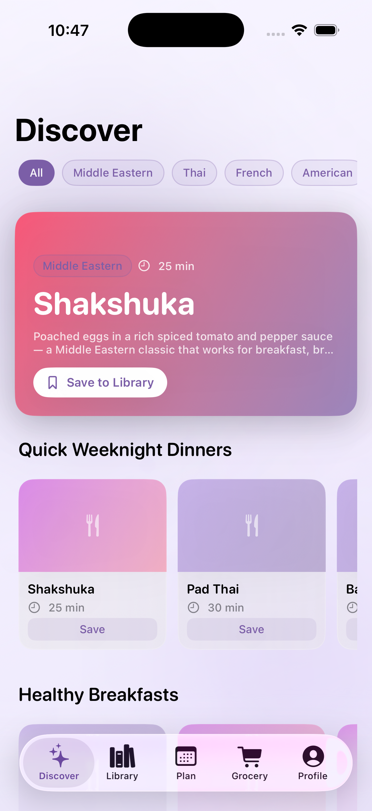
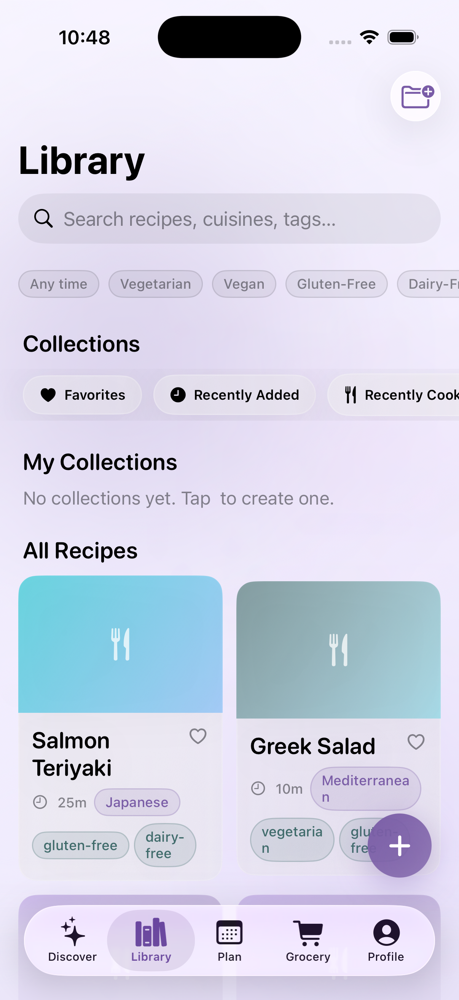
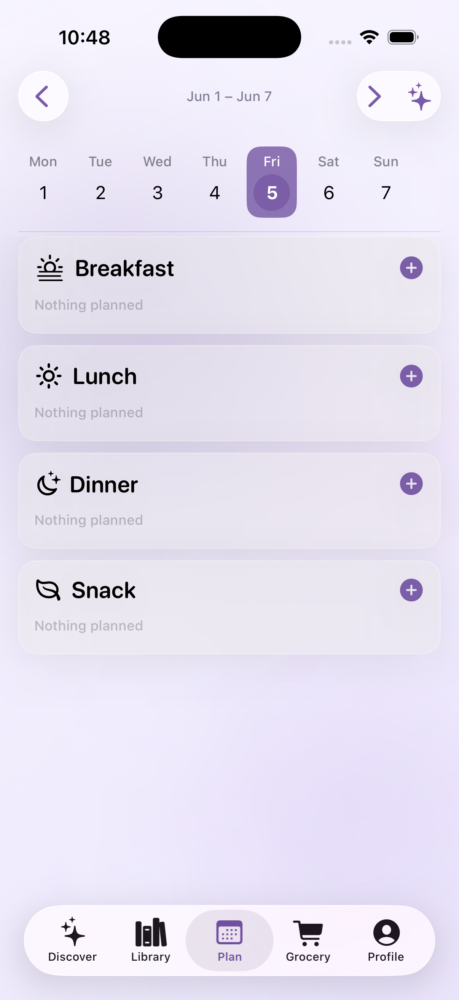
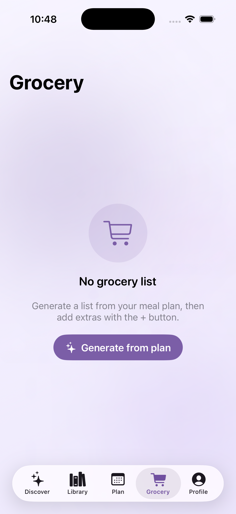
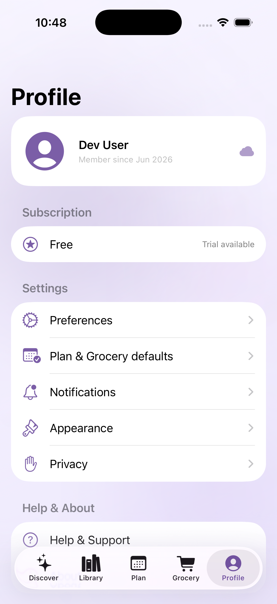

<div align="center">


# yumplz

**Save any recipe. Cook it later.**

[](project.yml)
[](project.yml)
[](LICENSE)
[](#testing)

> **Work in progress** — yumplz is under active development. Core flows work in the simulator today; CloudKit sync, App Store distribution, and the Content Library ingest pipeline are planned next. Expect breaking changes.

</div>

---

yumplz is a native **iOS recipe manager and meal planner** built with **SwiftUI**, **SwiftData**, and **fully on-device AI**. Import recipes from Safari, TikTok, YouTube, photos, or pasted text — parsed locally with Llama 3.2 3B — then organise them in a Collections-first library, plan your week, and cook hands-free in Cook Mode.

No backend. No API keys in the client. No cloud inference.

### Name check

**yumplz** (all lowercase) is a coined `yum` + `plz` mark — clearer than generic “yumyum” and no direct recipe-app match found at rename time. Still run your own [App Store](https://appstoreconnect.apple.com) name + trademark search before submission.

<p align="center">
  
  
  
</p>
<p align="center">
  
  
</p>

## Highlights

| Area | What it does |
|------|----------------|
| **Share import** | Safari / TikTok / YouTube → Share Extension → deep link → background import with live progress on a library card |
| **On-device AI** | Llama 3.2 3B (GGUF via [llama.swift](https://github.com/mattt/llama.swift)) parses recipe text to structured JSON; WhisperKit transcribes social videos |
| **Social routing** | TikTok oEmbed + caption extraction, YouTube description parsing — all on-device ([ADR 0006](docs/adr/0006-social-url-routing-on-device-no-server.md)) |
| **Library** | Collections-first grid, search & filters, async import cards, swipe-to-delete |
| **Cook Mode** | Step-by-step UI, mise en place, timers that survive background |
| **Plan & Grocery** | Week calendar, AI-assisted plan generation, aggregated grocery list from planned meals |
| **Architecture** | ADR-driven design, 195 unit/integration tests, strict Swift 6 concurrency |

## Quick start

### Prerequisites

- macOS with **Xcode 16+**
- [Homebrew](https://brew.sh) — `brew install xcodegen`
- iOS **17+** Simulator or device

One-time Xcode setup:

```bash
sudo xcode-select --switch /Applications/Xcode.app/Contents/Developer
sudo xcodebuild -license accept
```

### Build & run

```bash
git clone https://github.com/abhishekbiju/yumplz.git
cd yumplz
xcodegen generate
open Yumplz.xcodeproj
```

In Xcode: **Signing & Capabilities → set your Team** (required for Share Extension App Groups on a physical device). The bundle ID prefix is `com.abhishekbiju` — change it in [`project.yml`](project.yml) if you fork.

**DEBUG builds** include a *Continue without signing in (Dev)* button on the onboarding screen, which seeds sample recipes for local testing.

### CLI build & test

```bash
xcodegen generate

xcodebuild build \
  -scheme Yumplz \
  -destination 'platform=iOS Simulator,name=iPhone 17'

xcodebuild test \
  -scheme Yumplz \
  -destination 'platform=iOS Simulator,name=iPhone 17'
```

### Regenerate README screenshots

```bash
./scripts/capture-screenshots.sh
```

Requires a booted **iPhone 17** simulator. Uses DEBUG-only `YUMPLZ_SCREENSHOT_MODE` (not compiled into Release).

## Project layout

```
Yumplz/
├── App/                 Entry point, tabs, auth gate
├── Models/              SwiftData entities (Recipe, Ingredient, Step, …)
├── Features/
│   ├── Discover/        House Recipes curated feed
│   ├── Library/         Collections, grid, detail, edit, share
│   ├── Import/          Import sheet, model download gate
│   ├── CookMode/        Hands-free cooking UI + timers
│   ├── Plan/            Week calendar + AI plan generation
│   ├── Grocery/         Aggregated shopping list
│   └── Profile/         Preferences, appearance, privacy
├── Services/
│   ├── Import/          URL routing, OCR, social extractors, sanitizer
│   └── Inference/       Llama + WhisperKit wrappers, JSON parser
└── Resources/           Assets (AppIcon, Logo, AccentColor), HouseRecipes.json

YumplzShareExtension/   Share-to-yumplz extension
YumplzTests/            195 XCTest cases
docs/assets/             Exported icon sizes for marketing
CONTEXT.md               Domain glossary
project.yml              xcodegen spec (source of truth — .xcodeproj is gitignored)
```

## Design documentation

- [`CONTEXT.md`](CONTEXT.md) — domain glossary
- [`docs/PRD.md`](docs/PRD.md) — product requirements
- [`docs/adr/`](docs/adr/) — architectural decision records (CloudKit, local inference, Sign in with Apple, social routing, …)

## Tech stack

- **UI:** SwiftUI, custom glass design system
- **Persistence:** SwiftData (CloudKit sync planned — see [ADR 0001](docs/adr/0001-cloudkit-for-sync-no-custom-backend.md))
- **Inference:** Llama 3.2 3B Instruct Q4_K_M + WhisperKit base.en
- **Auth:** Sign in with Apple ([ADR 0003](docs/adr/0003-sign-in-with-apple-required-at-onboarding.md))
- **Project gen:** [XcodeGen](https://github.com/yonaskolb/XcodeGen)

## Security

This is a **public** repository. No API keys, credentials, or personal data belong in git. See [`SECURITY.md`](SECURITY.md) for the secrets policy and vulnerability reporting.

Model weights are downloaded at runtime from public Hugging Face URLs — they are **not** checked into the repo (~2 GB on first import).

## Roadmap

- [x] SwiftData domain model + 5-tab shell
- [x] Sign in with Apple onboarding (+ DEBUG dev bypass)
- [x] Recipe import pipeline (URL, photo, video, paste, manual)
- [x] Share Extension + deep-link auto-import
- [x] On-device Llama recipe parsing + truncated-JSON repair
- [x] Library, detail, edit, Cook Mode, Plan, Grocery
- [x] 195 automated tests
- [ ] CloudKit private sync (requires Apple Developer Program)
- [ ] StoreKit 2 paywall
- [ ] Spoonacular → CloudKit Public content ingest ([ADR 0002](docs/adr/0002-content-library-via-spoonacular-mirrored-into-cloudkit-public.md))
- [ ] TestFlight / App Store release

## License

[MIT](LICENSE) — Copyright (c) 2026 Abhishek Biju

---

<p align="center"><sub>App icon and marketing assets live in <code>docs/assets/</code> and <code>Yumplz/Resources/Assets.xcassets/</code>.</sub></p>
